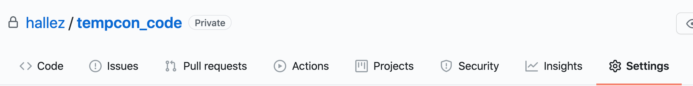
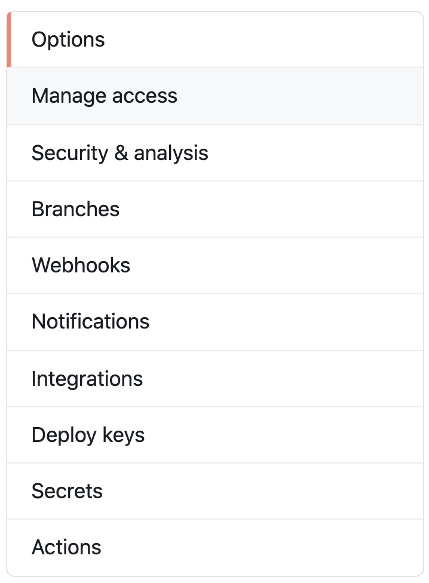
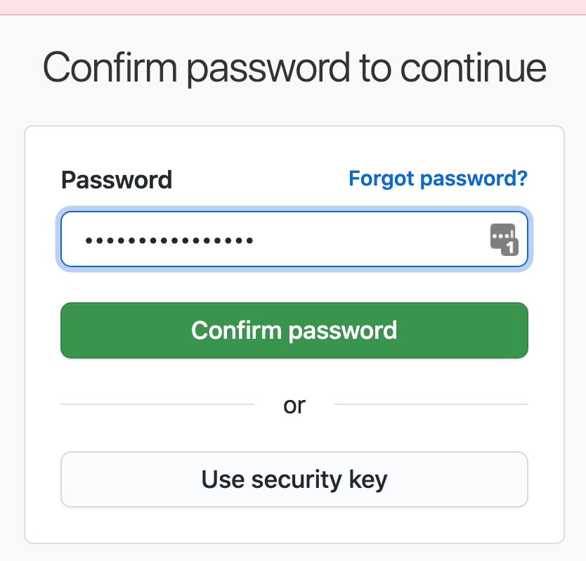
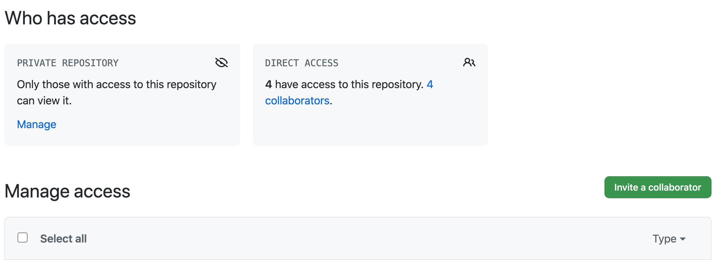
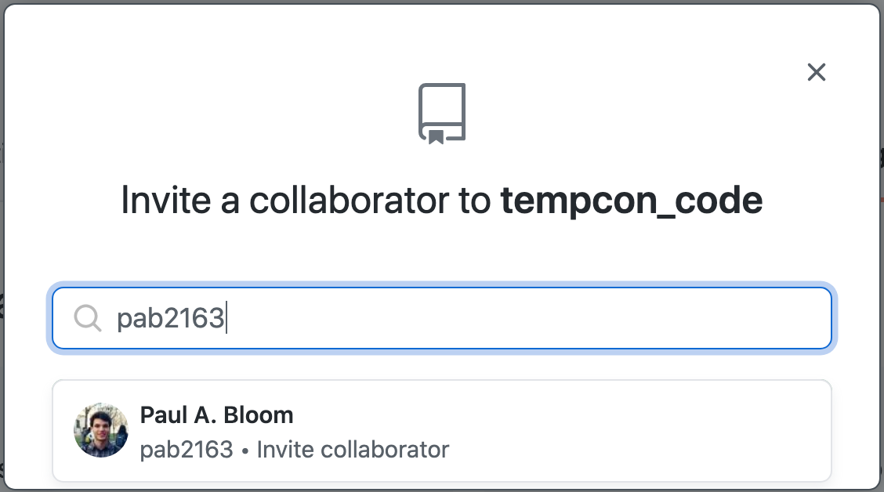
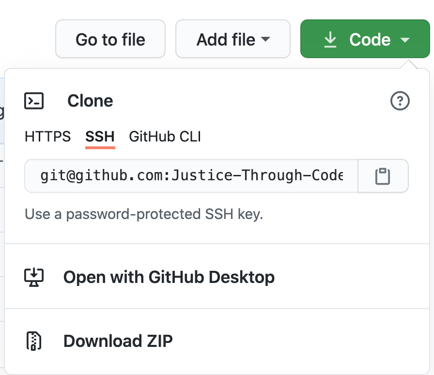
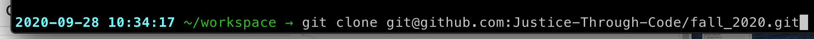

# Class 2 - Active Learning Challenge

In this challenge, you will:

* Modify your local Git settings to use your preferred text editor
* Add collaborators to a Git repository
* Practice dealing with merge conflicts

## Step 1: Updating your local Git settings

## Step 2: Adding collaborators
In order to work with someone else on a GitHub repository, you must grant them write access to the code.

(Note: If you are working on a *public* repository, others will already have access.)

This can be done on GitHub as long as you know the other person's username.

1. Go to your project's settings


2. Select `manage access`


3. You may need to confirm your login to GitHub - this is the password you initially used to login.


4. Select `invite a collaborator`


5. Find the person you want to collaborate with via their username, and actually send the invite!


Great! Now your collaborator should have full push/pull access to your repository.

In order for your collaborator to start working in your repository, they will need to accept the collaborator invitation. Usually, github will send them an email with a link to follow. If not, they should be able to see the invitation in their [notifications](https://github.com/notifications).

## Step 3: Creating a merge conflict
You can see another example of creating a merge conflict [here.](http://swcarpentry.github.io/git-novice/09-conflict/index.html)

1. Within your new shared repository, we will need to modify a file to use for our merge conflict example.

From terminal, let's create a new file:

```
touch merge-test.txt
```

Test yourself: what would happen if you did a `git status` right now?

In order for these changes to be tracked by Git, you will first need to add the file to what Git is watching. We will do this with `git add merge-test.txt`

What is the next step in making this commit?

1. Let's share this new file we created with our collaborator by pushing our commit with `git push`.

1. In order for your collaborator to see these changes on their computer, we will need to `git pull`.

If they have not yet cloned this repository to their computer and are just looking at the changes on GitHub, they will immediately be able to see this file once they refresh the page.

If the have not yet cloned the repository, this would be a good time to do so that they have a copy on their local machine.

They can copy the link to the repository from GitHub.



From terminal, they can then clone this to their local machine.

Make sure that you are doing this in the directory where you want the repository's folder to live. One suggestion is to create a folder where you will put all of your Git repos - that way you won't get confused with your operating system's default organization scheme (e.g.,  the `Documents` folder on a Mac).



2. Now, let's make a change to the file that we just created. You can do this by opening the file in your favorite text editor, adding some text, and saving the file.

Once again, we will need to have Git track the changes we have made in our repository.

```
git add -p
```

The `-p` allows us to add changes to the file in a piecemeal fashion. This option is very helpful when we start making lots of changes to a file.

Sometimes, we will want to break up our changes in separate commit messages and this `-p` option makes this easy to do. It also forces us to think about the changes we are committing by reviewing each change in the file as we add it to our commit.

After we have added all of the elements we want into the commit, we need to write our commit message:

```
git commit -m "A short, but clear message so that our future selves know what we did in this commit"
```

3. If we were actually working on our code, we might choose to make several commits before pushing our changes. (Remember the squirrel with their cheeks full of commit "nuts" we talked about before?) However, to move this example along, we are going to push our changes to the remote.

```
git push
```

4. Alright, now let's be bad collaborators and cause a conflict! Have your collaborator follow the above steps (i.e., create a file with the same name, make a change, and push that to GitHub).

For this example to work, your collaborator will need to use the *same filename* and add text that is on the same line(s) as you, but has different content.

For example, you might have written the following text in your file: `this is a piece of test code`

And your collaborator might instead say something like: `mwahahaha I'm going to be a crummy collaborator and cause a merge conflict!`

5. Have your collaborator commit their changes locally using `git commit -m`

6. Now, have your collaborator try to push their commit and see what happens.

Were you able to successfully push your code?

## Step 4: Resolving merge conflicts
1. In this case, your collaborator forgot to `git fetch` and then `git pull` at the beginning of their workflow so you both inadvertendly made changes to the same file.
