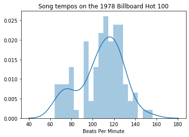
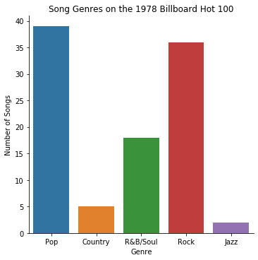
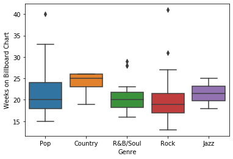
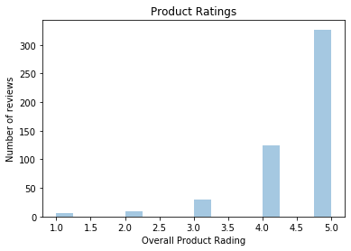
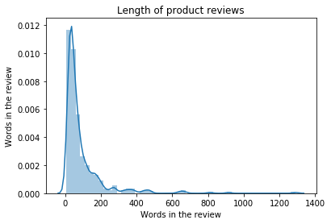
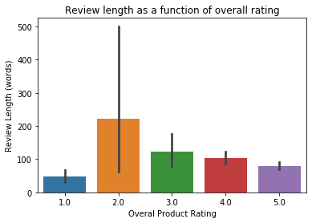
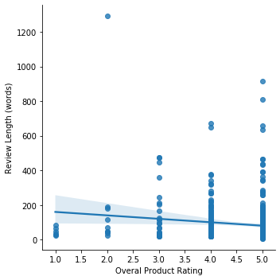
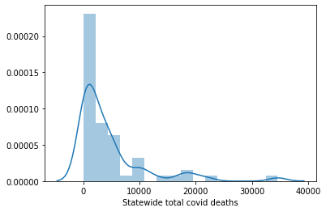
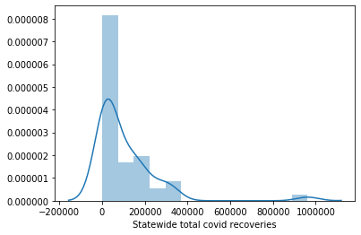
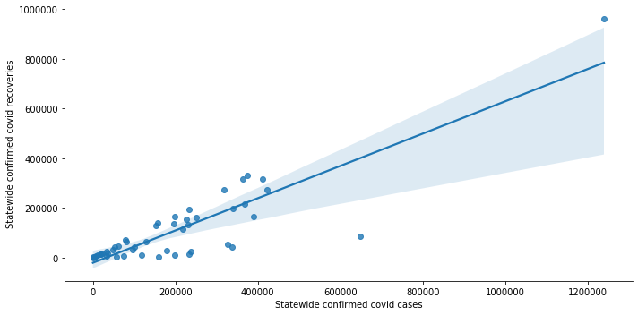

# Data visualization challenge: choose your own adventure!

In this challenge, you have the option to choose between several datasets, then make 3 different graphs from that dataset. In the last 10 minutes of class, each group will explain their graphs to the rest of the class!


## Part 1: Import pandas, seaborn, and matplotlib

**Hint:** Refer to the [data vis lesson](https://github.com/Justice-Through-Code/fall_2020/blob/master/lessons/31_data_visualization/data_vis.md) if you forgot how to do these steps


```python
import pandas as pd
import seaborn as sns
import matplotlib.pyplot as plt
%matplotlib inline
```

    /Users/paul/anaconda3/lib/python3.7/site-packages/statsmodels/tools/_testing.py:19: FutureWarning: pandas.util.testing is deprecated. Use the functions in the public API at pandas.testing instead.
      import pandas.util.testing as tm


## Part 2: Choose your dataset and import to a DataFrame

* **Option 1**: Billboard 1978 song data
    * [raw data here](https://raw.githubusercontent.com/Justice-Through-Code/fall_2020/master/datasets/billboard_1978.csv)
* **Option 2**: Amazon musical instrument review data:
    * [raw data here](https://raw.githubusercontent.com/Justice-Through-Code/fall_2020/master/datasets/musical_instrument_reviews.csv)
* **Option 3** Covid-19 data as of 11/30/2020 from Johns Hopkins University [more info here](https://github.com/CSSEGISandData/COVID-19)
    * [raw data here](https://raw.githubusercontent.com/CSSEGISandData/COVID-19/master/csse_covid_19_data/csse_covid_19_daily_reports_us/11-30-2020.csv)
    
    
Once you have imported, do any data cleaning you think you need before graphing


```python
billboard = pd.read_csv('https://raw.githubusercontent.com/Justice-Through-Code/fall_2020/master/datasets/billboard_1978.csv')
amazon = pd.read_csv('https://raw.githubusercontent.com/Justice-Through-Code/fall_2020/master/datasets/musical_instrument_reviews.csv')
covid = pd.read_csv('https://raw.githubusercontent.com/CSSEGISandData/COVID-19/master/csse_covid_19_data/csse_covid_19_daily_reports_us/11-30-2020.csv')
```


```python
billboard.head()
```


<div>
<table border="1" class="dataframe">
  <thead>
    <tr style="text-align: right;">
      <th></th>
      <th>Year</th>
      <th>Hot_Singles_Rank</th>
      <th>Title</th>
      <th>Artist</th>
      <th>Genre</th>
      <th>Weeks_On_Chart</th>
      <th>Peak_Chart_Position</th>
      <th>Maj_Min</th>
      <th>BPM</th>
    </tr>
  </thead>
  <tbody>
    <tr>
      <th>0</th>
      <td>1978</td>
      <td>1</td>
      <td>"Shadow Dancing"</td>
      <td>Andy Gibb</td>
      <td>Pop</td>
      <td>25.0</td>
      <td>1</td>
      <td>Min</td>
      <td>102</td>
    </tr>
    <tr>
      <th>1</th>
      <td>1978</td>
      <td>2</td>
      <td>"Night Fever"</td>
      <td>Bee Gees</td>
      <td>Pop</td>
      <td>20.0</td>
      <td>1</td>
      <td>Min</td>
      <td>110</td>
    </tr>
    <tr>
      <th>2</th>
      <td>1978</td>
      <td>3</td>
      <td>"You Light Up My Life"</td>
      <td>Debby Boone</td>
      <td>Country</td>
      <td>25.0</td>
      <td>1</td>
      <td>Maj</td>
      <td>78</td>
    </tr>
    <tr>
      <th>3</th>
      <td>1978</td>
      <td>4</td>
      <td>"Stayin' Alive"</td>
      <td>Bee Gees</td>
      <td>Pop</td>
      <td>27.0</td>
      <td>1</td>
      <td>Min</td>
      <td>103</td>
    </tr>
    <tr>
      <th>4</th>
      <td>1978</td>
      <td>5</td>
      <td>"Kiss You All Over"</td>
      <td>Exile</td>
      <td>Country</td>
      <td>23.0</td>
      <td>1</td>
      <td>Maj</td>
      <td>104</td>
    </tr>
  </tbody>
</table>
</div>


```python
amazon.head()
```


<div>
<table border="1" class="dataframe">
  <thead>
    <tr style="text-align: right;">
      <th></th>
      <th>reviewerID</th>
      <th>reviewerName</th>
      <th>reviewText</th>
      <th>overall</th>
      <th>summary</th>
      <th>reviewTime</th>
      <th>reviewWords</th>
    </tr>
  </thead>
  <tbody>
    <tr>
      <th>0</th>
      <td>A2IBPI20UZIR0U</td>
      <td>cassandra tu "Yeah, well, that's just like, u...</td>
      <td>Not much to write about here, but it does exac...</td>
      <td>5.0</td>
      <td>good</td>
      <td>02 28, 2014</td>
      <td>51</td>
    </tr>
    <tr>
      <th>1</th>
      <td>A14VAT5EAX3D9S</td>
      <td>Jake</td>
      <td>The product does exactly as it should and is q...</td>
      <td>5.0</td>
      <td>Jake</td>
      <td>03 16, 2013</td>
      <td>104</td>
    </tr>
    <tr>
      <th>2</th>
      <td>A195EZSQDW3E21</td>
      <td>Rick Bennette "Rick Bennette"</td>
      <td>The primary job of this device is to block the...</td>
      <td>5.0</td>
      <td>It Does The Job Well</td>
      <td>08 28, 2013</td>
      <td>77</td>
    </tr>
    <tr>
      <th>3</th>
      <td>A2C00NNG1ZQQG2</td>
      <td>RustyBill "Sunday Rocker"</td>
      <td>Nice windscreen protects my MXL mic and preven...</td>
      <td>5.0</td>
      <td>GOOD WINDSCREEN FOR THE MONEY</td>
      <td>02 14, 2014</td>
      <td>35</td>
    </tr>
    <tr>
      <th>4</th>
      <td>A94QU4C90B1AX</td>
      <td>SEAN MASLANKA</td>
      <td>This pop filter is great. It looks and perform...</td>
      <td>5.0</td>
      <td>No more pops when I record my vocals.</td>
      <td>02 21, 2014</td>
      <td>28</td>
    </tr>
  </tbody>
</table>
</div>


```python
covid.head()
```


<div>
<table border="1" class="dataframe">
  <thead>
    <tr style="text-align: right;">
      <th></th>
      <th>Province_State</th>
      <th>Country_Region</th>
      <th>Last_Update</th>
      <th>Lat</th>
      <th>Long_</th>
      <th>Confirmed</th>
      <th>Deaths</th>
      <th>Recovered</th>
      <th>Active</th>
      <th>FIPS</th>
      <th>Incident_Rate</th>
      <th>Total_Test_Results</th>
      <th>People_Hospitalized</th>
      <th>Case_Fatality_Ratio</th>
      <th>UID</th>
      <th>ISO3</th>
      <th>Testing_Rate</th>
      <th>Hospitalization_Rate</th>
    </tr>
  </thead>
  <tbody>
    <tr>
      <th>0</th>
      <td>Alabama</td>
      <td>US</td>
      <td>2020-12-01 05:30:26</td>
      <td>32.3182</td>
      <td>-86.9023</td>
      <td>249524</td>
      <td>3578</td>
      <td>161946.0</td>
      <td>84000.0</td>
      <td>1.0</td>
      <td>5089.018668</td>
      <td>1584347.0</td>
      <td>NaN</td>
      <td>1.433930</td>
      <td>84000001.0</td>
      <td>USA</td>
      <td>32312.609049</td>
      <td>NaN</td>
    </tr>
    <tr>
      <th>1</th>
      <td>Alaska</td>
      <td>US</td>
      <td>2020-12-01 05:30:26</td>
      <td>61.3707</td>
      <td>-152.4044</td>
      <td>32576</td>
      <td>121</td>
      <td>7165.0</td>
      <td>25290.0</td>
      <td>2.0</td>
      <td>4453.041166</td>
      <td>1011396.0</td>
      <td>NaN</td>
      <td>0.371439</td>
      <td>84000002.0</td>
      <td>USA</td>
      <td>138254.789521</td>
      <td>NaN</td>
    </tr>
    <tr>
      <th>2</th>
      <td>American Samoa</td>
      <td>US</td>
      <td>2020-12-01 05:30:26</td>
      <td>-14.2710</td>
      <td>-170.1320</td>
      <td>0</td>
      <td>0</td>
      <td>NaN</td>
      <td>0.0</td>
      <td>60.0</td>
      <td>0.000000</td>
      <td>1988.0</td>
      <td>NaN</td>
      <td>NaN</td>
      <td>16.0</td>
      <td>ASM</td>
      <td>3572.904872</td>
      <td>NaN</td>
    </tr>
    <tr>
      <th>3</th>
      <td>Arizona</td>
      <td>US</td>
      <td>2020-12-01 05:30:26</td>
      <td>33.7298</td>
      <td>-111.4312</td>
      <td>326817</td>
      <td>6639</td>
      <td>52438.0</td>
      <td>267740.0</td>
      <td>4.0</td>
      <td>4490.035813</td>
      <td>2253689.0</td>
      <td>NaN</td>
      <td>2.031412</td>
      <td>84000004.0</td>
      <td>USA</td>
      <td>30962.723238</td>
      <td>NaN</td>
    </tr>
    <tr>
      <th>4</th>
      <td>Arkansas</td>
      <td>US</td>
      <td>2020-12-01 05:30:26</td>
      <td>34.9697</td>
      <td>-92.3731</td>
      <td>157359</td>
      <td>2502</td>
      <td>138696.0</td>
      <td>16161.0</td>
      <td>5.0</td>
      <td>5214.354544</td>
      <td>1683457.0</td>
      <td>NaN</td>
      <td>1.589995</td>
      <td>84000005.0</td>
      <td>USA</td>
      <td>55784.172862</td>
      <td>NaN</td>
    </tr>
  </tbody>
</table>
</div>


## Part 3: Graph

For this challenge:

1. Make a histogram or bar graph showing the distribution of 1 single variable
2. Make a histogram or bar graph showing the distribution of another single variable
3. Make a scatterplot (with or without the line of best fit), box plot, or bar plot showing the relationship between 2 different variables. It does not have to be the variables you used for 1 or 2. 

Customize all your plots to give them clear labels/titles, and save them to either pdf or png files. Get ready to show your graphs to the rest of the class!

## Billboard examples


```python
ax = sns.distplot(billboard['BPM'], bins = 20)
ax.set(xlabel = 'Beats Per Minute', title = 'Song tempos on the 1978 Billboard Hot 100')
plt.savefig('billboard_tempo.pdf')
```





```python
ax = sns.catplot(data = billboard, x = 'Genre', kind = 'count')
ax.set(ylabel = 'Number of Songs', title = 'Song Genres on the 1978 Billboard Hot 100')
plt.savefig('billboard_song_genre.pdf')
```





```python
ax = sns.boxplot(data = billboard, x = 'Genre', y = 'Weeks_On_Chart')
ax.set(ylabel = 'Weeks on Billboard Chart')
plt.savefig('billboard_weeks.pdf')
```





# Amazon review examples


```python
ax = sns.distplot(amazon['overall'], kde = False, )
ax.set(xlabel = 'Overall Product Rading', ylabel = 'Number of reviews', title = 'Product Ratings')
plt.savefig('amazon_ratings.pdf')
```





```python
ax = sns.distplot(amazon['reviewWords'])
ax.set(xlabel = 'Words in the review', ylabel = 'Words in the review', title = 'Length of product reviews')
plt.savefig('amazon_review_length.pdf')
```





```python
ax = sns.barplot(data = amazon, x = 'overall', y = 'reviewWords')
ax.set(xlabel = 'Overal Product Rating', ylabel = 'Review Length (words)', 
       title = 'Review length as a function of overall rating')
plt.savefig('amazon_rating_length_reviews.pdf')
```





```python
ax = sns.lmplot(data = amazon, x = 'overall', y = 'reviewWords')
ax.set(xlabel = 'Overal Product Rating', ylabel = 'Review Length (words)')
plt.savefig('amazon_rating_length_reviews_lm.pdf')
```





# COVID examples


```python
ax = sns.distplot(covid['Deaths'])
ax.set(xlabel = 'Statewide total covid deaths')
plt.savefig('covid_deaths.pdf')
```





```python
ax = sns.distplot(covid['Recovered'])
ax.set(xlabel = 'Statewide total covid recoveries')
plt.savefig('covid_recoveries.pdf')
```





```python
ax = sns.scatterplot(data = covid, x = 'Confirmed', y = 'Recovered')
ax.set(xlabel = 'Statewide confirmed covid cases', ylabel = 'Statewide confirmed covid recoveries')
plt.savefig('covid_confirmed_recover_scatter.pdf')
```


```python
ax = sns.lmplot(data = covid, x = 'Confirmed', y = 'Recovered',height = 5, aspect = 2)
ax.set(xlabel = 'Statewide confirmed covid cases', ylabel = 'Statewide confirmed covid recoveries')
plt.savefig('covid_confirmed_recover_lm.pdf')
```





```python

```
