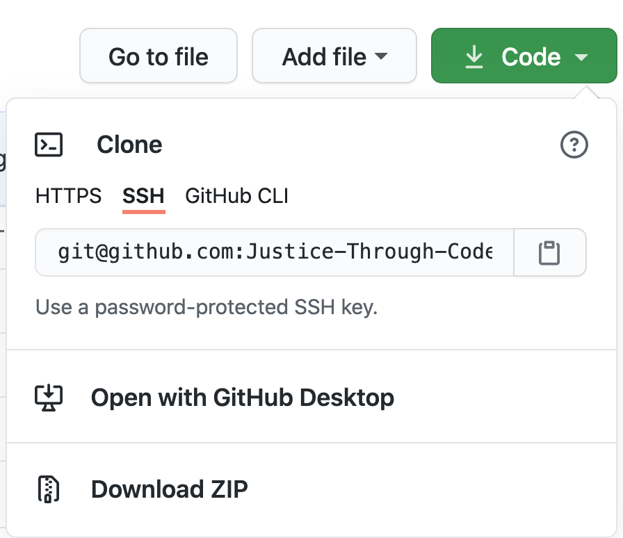
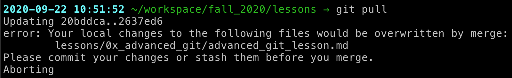

# Before class

# Outline of class agenda
1. Learn about using git with another user (i.e., collaborating on code)
2. Setting up Git preferences on our computers
3. Trying out some collaborative coding

# Class
## 1. Refresher on Git
In one of the first weeks, we covered Git. It is a tool for version control. That is, it's responsible for "watching" our files and tracking changes (usually to the cloud, i.e., GitHub).

Unlike systems that do this in a totally automated fashion (e.g., Dropbox, GoogleDrive), Git requires some manual input from the user. Although you may initially find this annoying to have to manually mark changes and move files from your local version to remote version, it is helpful because it grants you complete control and also enables you to make notes about the changes being made.

If you are working on your own, a typical Git workflow might look something like this:

```
touch testfile.md
<make some changes>
git status testfile.md
git add -p testfile.md
git commit -m "helpful message about the changes you just made"
```

This now means that Git has tracked the changes in your file, but these changes have not yet been shared ("pushed") to the remote location (usually, this is GitHub).

You can push your changes at any time using `git push`, however, it can be advantageous to wait to push your changes until you are satisfied that whatever code you are working on works and will not introduce problems in other parts of the code.

It's also a good idea to push your changes at the end of your working session (just in case anything happens to your computer!) You can picture yourself like a squirrel holding of lots of commit "nuts" in your cheeks.


When you are working on your own, when you push your code really only impacts you. However, when you are working with someone else, anytime you push your code you are basically telling the other people you are working with that your work is in a semi-final state where combining ("pulling") your code into theirs will not cause any breaking changes.

We will talk about good practices for Git collaboration in the next sections.

## 1. Why use Git to collaborate?
Git was actually designed solely to facilitate collaboration. It was created to help when people were working on building the Linux cluster, a common open-source operating system.

(You can read more about the history of Git [here](https://git-scm.com/book/en/v2/Getting-Started-A-Short-History-of-Git) if you're interested.)

Version control systems, which is the general name for programs like Git, allow people to be simultaneously editing code and documents. If you have ever tried to open a Word document or another shared file in a Dropbox folder, you can probably see why this is a real benefit!


Instead, Git allows each user to have a local version of the code's folder ("repository"). You get this local version by "cloning" a version from a centralized location, usually GitHub.org



You can make some local changes, committing as you go, and then `push` your changes back to GitHub when you're ready.

We're now going to take a look at some of the nitty gritty of how this collaboration process works, and some typical problems you might encounter. You'll also practice this in the challenge exercise late.

## 1. What are the basic steps of collaborating on Git?
The first step of collaborating with Git is controlling who has edit access to the code. We will work on this in the challenge later.

The other major consideration is how to amend your standard workflow to enable collaboration and try to avoid problems. Earlier, we talked about a typical work flow that looked like this:

```
touch testfile.md
<make some changes>
git status testfile.md
git add -p testfile.md
git commit -m "helpful message about the changes you just made"
```

However, if you are working with someone else, they might have made changes since the last time you were working on the project. Therefore, we need to add a very important first step of checking to see if there are any changes on the remote branch.

```
git fetch
git status
```

Fetching essentially "sniffs" the remote location to see whether your local version and the remote version are at the same place or not. Importantly, fetching does not actually accept the changes from the remote location. Checking the status tells you the result of this comparison.

Why do you think it might be helpful to check for changes before actually accepting them?

Typically, you will either already be in sync with the remote branch or you will need to "pull" the changes.

Here is an example of what your system might look like after fetching:


It looks like there are no new changes that you need to integrate with your local copy of the code so there is no need to perform a `git pull` at this time.

Here is another possibility of how your system might appear after fetching:


In this case, the changes made to the local version and the one from GitHub were done in separate sections of the code so it's easy to simply `git pull` those changes to your local copy of the repository.

Pulling the changes means that you are accepting the current state of the code at the remote location.

```
git pull
```

Sometimes, you will try to pull the code but will get an error message that you have local changes that you need to commit first so they don't get trampled on when you pull in your collaborator's changes.



In this case, you can either do a `git commit` if you are ready to accept this bite of work you've done or you can temporarily `git stash` your changes so that they are protected when you pull in the new code and then `git pop stash` and continue where you left off.


However, sometimes you and your collaborator will step on each others' toes and will edit the same part of the code at the same time. Then, when you do your `git fetch`, you might instead see a message like this:


This is a merge conflict. We will talk about how to deal with these in the challenge.

Remember that Git is always keeping track of changes to files so pulling might overwrite your work if you and your collaborator were editing the same part of the code, but you can always recover your work. In the next section, we will talk about how to handle these kinds of conflicts.

## 1. What are some common problems you might encounter when collaborating?
Hopefully, you and your collaborator divided up the work on the project so that you are each working on separate parts of the code. However, there will sometimes be cases where either accidentally or intentionally you are both working on the same lines of code. In these cases, when you pull in your collaborator's changes you may get what is called a merge conflict. That might look something like this:

XXX
