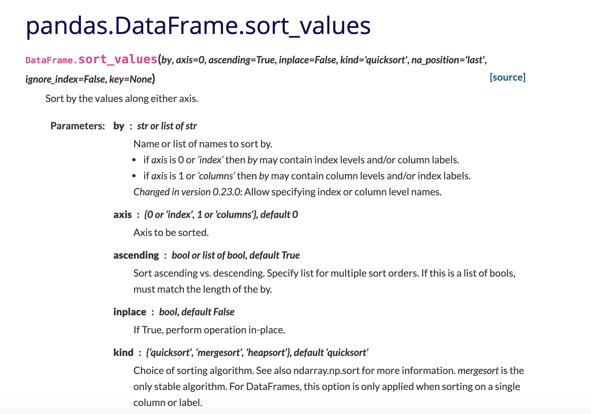

# Pandas -- Working with documentation

# Outline of class agenda

Todays class is focused on learning how to work with *documentation* to implement code solutions, with a special focus on the Pandas library

During this class you'll:

1. Practice working with pandas more
2. Get comfortable working with the pandas documentation
3. Learn about working with documentation more generally


### What is documentation? 

* Documentation is basically a formal way for a python library to provide a 'users guide'
* Documentation usually shows how code works, especially
    * Available functions, their arguments, and what they return
    * Available classes and their attributes
    * Example use cases of functions/classes
* Almost every python library has documentation of some form on the web, including [base python itself](https://docs.python.org/3/)
* Documentation for some libraries is much better than others 
    * [Pandas](https://pandas.pydata.org/docs/user_guide/index.html) has very good documentation!
    
    
### Why use documentation?

Often, if a library has good documentation (like Pandas), the documentation is the first place to go if:
* You're stuck trying to get a function to work
* You want to be able to do a certain thing and you think the library might have a function that can do it
    * For example, if there's something you want to do with a Pandas DataFrame object, the Pandas docs are a great place to start

# Class


### Setup

First, to get started, we'll read in the same csv file into a pandas DataFrame as last class. As a reminder, this is a database of information about different songs from sp


```python
# don't forget to import! 
import pandas as pd
spotify = pd.read_csv('../../datasets/spotify_top_tens.csv')
spotify.head()
```


<div>
<table border="1" class="dataframe">
  <thead>
    <tr style="text-align: right;">
      <th></th>
      <th>title</th>
      <th>artist</th>
      <th>top genre</th>
      <th>year</th>
      <th>bpm</th>
      <th>nrgy</th>
      <th>dnce</th>
      <th>dB</th>
      <th>live</th>
      <th>val</th>
      <th>dur</th>
      <th>acous</th>
      <th>spch</th>
      <th>pop</th>
    </tr>
  </thead>
  <tbody>
    <tr>
      <th>0</th>
      <td>Hey, Soul Sister</td>
      <td>Train</td>
      <td>neo mellow</td>
      <td>2010</td>
      <td>97</td>
      <td>89</td>
      <td>67</td>
      <td>-4</td>
      <td>8</td>
      <td>80</td>
      <td>217</td>
      <td>19</td>
      <td>4</td>
      <td>83</td>
    </tr>
    <tr>
      <th>1</th>
      <td>Love The Way You Lie</td>
      <td>Eminem</td>
      <td>detroit hip hop</td>
      <td>2010</td>
      <td>87</td>
      <td>93</td>
      <td>75</td>
      <td>-5</td>
      <td>52</td>
      <td>64</td>
      <td>263</td>
      <td>24</td>
      <td>23</td>
      <td>82</td>
    </tr>
    <tr>
      <th>2</th>
      <td>TiK ToK</td>
      <td>Kesha</td>
      <td>dance pop</td>
      <td>2010</td>
      <td>120</td>
      <td>84</td>
      <td>76</td>
      <td>-3</td>
      <td>29</td>
      <td>71</td>
      <td>200</td>
      <td>10</td>
      <td>14</td>
      <td>80</td>
    </tr>
    <tr>
      <th>3</th>
      <td>Bad Romance</td>
      <td>Lady Gaga</td>
      <td>dance pop</td>
      <td>2010</td>
      <td>119</td>
      <td>92</td>
      <td>70</td>
      <td>-4</td>
      <td>8</td>
      <td>71</td>
      <td>295</td>
      <td>0</td>
      <td>4</td>
      <td>79</td>
    </tr>
    <tr>
      <th>4</th>
      <td>Just the Way You Are</td>
      <td>Bruno Mars</td>
      <td>pop</td>
      <td>2010</td>
      <td>109</td>
      <td>84</td>
      <td>64</td>
      <td>-5</td>
      <td>9</td>
      <td>43</td>
      <td>221</td>
      <td>2</td>
      <td>4</td>
      <td>78</td>
    </tr>
  </tbody>
</table>
</div>


# Demos on working with the [Pandas documentation](https://pandas.pydata.org/docs/user_guide/index.html)

This part is a *little* bit like the lesson on Googling we did -- we'll browse the Pandas documentation first, then show a few examples of searching for things using it

# Example 1: Using pandas docs to figure out how select columns by their names

In this example we want to make a new DataFrame with just the `title`, `artist`, and `top genre` columns. 
* We talked about using `iloc()` to select parts of the DataFrame using their numeric positions, but now we want to use the Pandas docs to figure out how to select these 3 columns by their names.


#### Step 1 -- go to pandas docs

It is at https://pandas.pydata.org/docs/

#### Step 2 --- go to the user guide

One of the most helpful parts of the Pandas documentation (though not the only part) is the [user guide section](https://pandas.pydata.org/docs/user_guide/index.html)


This can seem a little intimidating at first because there is a LOT on here -- take a minute to click around and explore a few pages.

#### Step 3 -- go to the ['Indexing and selecting data'](https://pandas.pydata.org/docs/user_guide/indexing.html) section

Still a LOT of info on this page, but we are getting close to the right information! 
* We can see descriptions of using the `iloc()` function we worked with last time

But, if we scroll down a little, we can see the spot in the docs that really seems to answer our question: 


So, this seems to be telling us that we can select columns by their names using the `frame[colname]` syntax. There are even some examples below:


#### Step 4 -- try out the code for your use based on the info/examples in the docs

Okay! So it looks like we can select columns with the syntax as:
   * `frame['column name in quotes']`
   * `frame[['column1', 'column2']]`
   
   
Let's try it out!


```python
# This gives us just the columnn 'title'
spotify['title']
```


    0                                       Hey, Soul Sister
    1                                   Love The Way You Lie
    2                                                TiK ToK
    3                                            Bad Romance
    4                                   Just the Way You Are
                                 ...                        
    598                  Find U Again (feat. Camila Cabello)
    599        Cross Me (feat. Chance the Rapper & PnB Rock)
    600    No Brainer (feat. Justin Bieber, Chance the Ra...
    601      Nothing Breaks Like a Heart (feat. Miley Cyrus)
    602                                     Kills You Slowly
    Name: title, Length: 603, dtype: object


```python
# by putting multiple column names in an additional list, we can get a dataframe of those columns back
spotify[['title', 'artist', 'top genre']]
```


<div>
<table border="1" class="dataframe">
  <thead>
    <tr style="text-align: right;">
      <th></th>
      <th>title</th>
      <th>artist</th>
      <th>top genre</th>
    </tr>
  </thead>
  <tbody>
    <tr>
      <th>0</th>
      <td>Hey, Soul Sister</td>
      <td>Train</td>
      <td>neo mellow</td>
    </tr>
    <tr>
      <th>1</th>
      <td>Love The Way You Lie</td>
      <td>Eminem</td>
      <td>detroit hip hop</td>
    </tr>
    <tr>
      <th>2</th>
      <td>TiK ToK</td>
      <td>Kesha</td>
      <td>dance pop</td>
    </tr>
    <tr>
      <th>3</th>
      <td>Bad Romance</td>
      <td>Lady Gaga</td>
      <td>dance pop</td>
    </tr>
    <tr>
      <th>4</th>
      <td>Just the Way You Are</td>
      <td>Bruno Mars</td>
      <td>pop</td>
    </tr>
    <tr>
      <th>...</th>
      <td>...</td>
      <td>...</td>
      <td>...</td>
    </tr>
    <tr>
      <th>598</th>
      <td>Find U Again (feat. Camila Cabello)</td>
      <td>Mark Ronson</td>
      <td>dance pop</td>
    </tr>
    <tr>
      <th>599</th>
      <td>Cross Me (feat. Chance the Rapper &amp; PnB Rock)</td>
      <td>Ed Sheeran</td>
      <td>pop</td>
    </tr>
    <tr>
      <th>600</th>
      <td>No Brainer (feat. Justin Bieber, Chance the Ra...</td>
      <td>DJ Khaled</td>
      <td>dance pop</td>
    </tr>
    <tr>
      <th>601</th>
      <td>Nothing Breaks Like a Heart (feat. Miley Cyrus)</td>
      <td>Mark Ronson</td>
      <td>dance pop</td>
    </tr>
    <tr>
      <th>602</th>
      <td>Kills You Slowly</td>
      <td>The Chainsmokers</td>
      <td>electropop</td>
    </tr>
  </tbody>
</table>
<p>603 rows × 3 columns</p>
</div>


```python
# we can even save that to another variable
song_info = spotify[['title', 'artist', 'top genre']]
song_info.head()
```


<div>
<table border="1" class="dataframe">
  <thead>
    <tr style="text-align: right;">
      <th></th>
      <th>title</th>
      <th>artist</th>
      <th>top genre</th>
    </tr>
  </thead>
  <tbody>
    <tr>
      <th>0</th>
      <td>Hey, Soul Sister</td>
      <td>Train</td>
      <td>neo mellow</td>
    </tr>
    <tr>
      <th>1</th>
      <td>Love The Way You Lie</td>
      <td>Eminem</td>
      <td>detroit hip hop</td>
    </tr>
    <tr>
      <th>2</th>
      <td>TiK ToK</td>
      <td>Kesha</td>
      <td>dance pop</td>
    </tr>
    <tr>
      <th>3</th>
      <td>Bad Romance</td>
      <td>Lady Gaga</td>
      <td>dance pop</td>
    </tr>
    <tr>
      <th>4</th>
      <td>Just the Way You Are</td>
      <td>Bruno Mars</td>
      <td>pop</td>
    </tr>
  </tbody>
</table>
</div>


# Example 2: using pandas docs to figure out how sort the DataFrame

Let's say we want to sort the whole DataFrame by the `artist` column to get the artists in alphabetical order. Let's use the pandas docs to figure out how to do this.


#### Step 1: google for the right place in the docs?
This might be a good place to mention that **GOOGLING** is often one of the best ways to find the right part of the docs. For example, if we google 'pandas documentation sort dataframe', the first hit brings us to [a very relevant page in the docs](https://pandas.pydata.org/pandas-docs/stable/reference/api/pandas.DataFrame.sort_values.html). 

Now, this page is in the ['API reference'](https://pandas.pydata.org/pandas-docs/stable/reference/index.html) section of the pandas documentation, which is essentially a guide to each function/method available (with examples).




#### Step 2 - inspect the method & parameters

This is super useful, because it is showing us that there is a DataFrame method called `sort_values`, and it is showing us what the parameters are , and their defaults! 
* Notice that for each parameter, the docs tell us what **type** they can be. 
* For example, the function takes a parameter `by`, which is either a `str` or `list of str`

#### Step 3 - check out the examples 

Pretty much every method in the pandas docs has some case examples, which are usually very helpful. Here, we can see how to use this method to sort the example DataFrame by the column `col1`


#### Step 4: Try it out for yourself!

So, now we can try to use the `sort_values()` method to sort `song_info` by `artist`


```python
# we'll save out to a new DataFrame called `songs_by_artist` here
songs_by_artist = song_info.sort_values(by = 'artist')
```


```python
songs_by_artist.head(10)
```


<div>
<table border="1" class="dataframe">
  <thead>
    <tr style="text-align: right;">
      <th></th>
      <th>title</th>
      <th>artist</th>
      <th>top genre</th>
    </tr>
  </thead>
  <tbody>
    <tr>
      <th>31</th>
      <td>My First Kiss - feat. Ke$ha</td>
      <td>3OH!3</td>
      <td>dance pop</td>
    </tr>
    <tr>
      <th>229</th>
      <td>She Looks So Perfect</td>
      <td>5 Seconds of Summer</td>
      <td>boy band</td>
    </tr>
    <tr>
      <th>249</th>
      <td>Say Something</td>
      <td>A Great Big World</td>
      <td>neo mellow</td>
    </tr>
    <tr>
      <th>21</th>
      <td>Whataya Want from Me</td>
      <td>Adam Lambert</td>
      <td>australian pop</td>
    </tr>
    <tr>
      <th>37</th>
      <td>If I Had You</td>
      <td>Adam Lambert</td>
      <td>australian pop</td>
    </tr>
    <tr>
      <th>52</th>
      <td>Someone Like You</td>
      <td>Adele</td>
      <td>british soul</td>
    </tr>
    <tr>
      <th>112</th>
      <td>Set Fire to the Rain</td>
      <td>Adele</td>
      <td>british soul</td>
    </tr>
    <tr>
      <th>295</th>
      <td>Hello</td>
      <td>Adele</td>
      <td>british soul</td>
    </tr>
    <tr>
      <th>55</th>
      <td>Rolling in the Deep</td>
      <td>Adele</td>
      <td>british soul</td>
    </tr>
    <tr>
      <th>504</th>
      <td>Water Under the Bridge</td>
      <td>Adele</td>
      <td>british soul</td>
    </tr>
  </tbody>
</table>
</div>


Great! Looks like it worked (although maybe we'll have to clean it later, since the artists with numbers starting the names seemed to get ranked first in the alphabet). 

Note -- sometimes it can be tricky to transfer code right from the docs to our own uses, so don't worry if it doesn't run the first time. It will often take some experimentation to get it to work!


# Overview

Nice work! Today we learned:
* What documentation is and why it might be helpful
* How to get started with the [pandas documentation](https://pandas.pydata.org/pandas-docs/stable/index.html)
* How to select Pandas columns by name using `df['column_name']` syntax
* How to sort Pandas DataFrames by a column using the `df.sort_values()` method

This has been a very brief overview of a few ways of using the pandas documentation. Most python libraries have their own documentation, so they key to getting used to working with documentation is practice. That's exactly what we'll do in the challenge -- just like the googling challenge you'll have to figure out a few things using the documentation.
